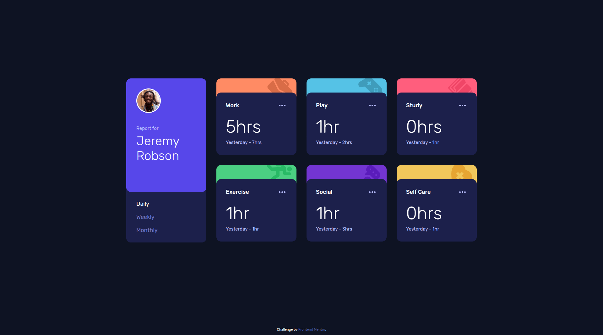

# Frontend Mentor - Time Tracking Dashboard

This is a solution to the [Time tracking dashboard challenge on Frontend Mentor](https://www.frontendmentor.io/challenges/time-tracking-dashboard-UIQ7167Jw).

## Overview

A responsive dashboard that lets users switch between Daily, Weekly and Monthly timeframes. The interface show current time and previous period time (e.g. "Yesterday - 2hrs", "Last Week - 32hrs").

This project uses a local `data.json` file as the source of activity data and is implemented as a static site.

### Screenshot

### Links

- https://biruchenko.github.io/time-tracking-dashboard/

### Built with

- Semantic HTML5
- SCSS (Sass) — compiled to CSS
- Flexbox & CSS Grid
- Vanilla JavaScript (DOM manipulation)

## Acknowledgments

- Challenge by [Frontend Mentor](https://www.frontendmentor.io).
